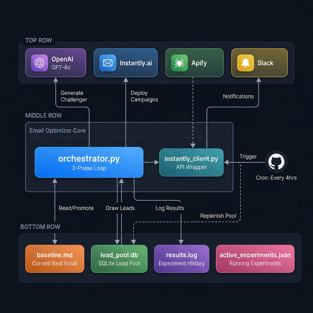
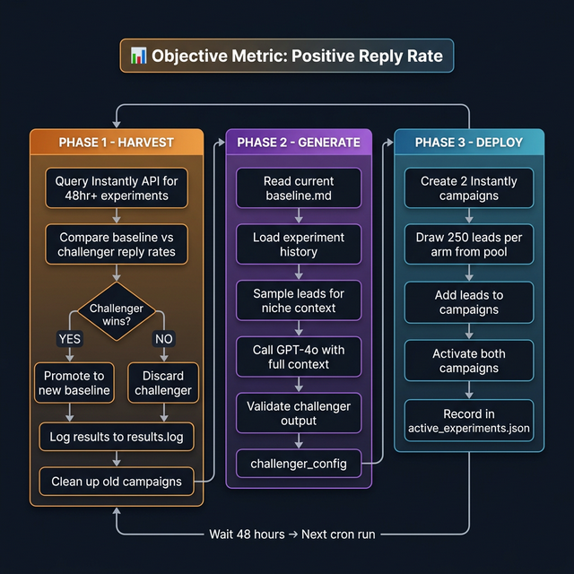

# 📧 Email Optimizer

**Autonomous cold email A/B testing, powered by AI.**

An autonomous cold email optimization system inspired by [Karpathy's autoresearch](https://github.com/karpathy/autoresearch) pattern. It runs headless on a GitHub Actions cron — zero human input needed after initial setup. The system continuously evolves email copy through automated A/B experiments, using **positive reply rate** as the sole objective metric.

---

## System Architecture



The system is composed of three layers:

- **External Services** — OpenAI GPT-4o (AI copy generation), Instantly.ai (email campaigns), Apify (lead scraping), and Slack (notifications).
- **Core Engine** — `orchestrator.py` runs the 3-phase optimization loop. It coordinates all API calls through `instantly_client.py`.
- **Data Layer** — Local files and SQLite databases store the evolving baseline, experiment history, lead pool, and active experiments.

GitHub Actions triggers the entire pipeline on a cron schedule (every 4 hours).

---

## The 3-Phase Optimization Loop



Every 4 hours, the system executes three phases in sequence:

### Phase 1 — Harvest

- Queries the Instantly API for experiments that have been running for 48+ hours
- Compares baseline vs challenger **positive reply rates**
- If the challenger wins (higher reply rate with at least 1 reply), it gets **promoted to the new baseline**
- If not, the challenger is discarded and the baseline is kept
- Results are logged to `results/results.log` (append-only JSONL)
- Old campaigns are cleaned up (paused, leads deleted, campaigns removed)

### Phase 2 — Generate

- Reads the current `config/baseline.md` (the email being evolved)
- Loads product context (`data/resource.md`), cold email strategy (`data/cold-email-course.md`), and the last 50 experiment results
- Samples leads from the pool to understand the target niche
- Calls **OpenAI GPT-4o** with all this context to generate a challenger variant
- The challenger is a **copy-only mutation** — same lead filters, different subject/body/CTA
- Validates the output has parseable email steps before proceeding

### Phase 3 — Deploy

- Creates two Instantly campaigns: one for baseline, one for challenger
- Draws **250 leads per arm** from `lead_pool.db` (SQLite), marking them as assigned
- Uploads leads to the respective campaigns via the Instantly API
- Activates both campaigns and verifies they are running
- Records the experiment in `data/active_experiments.json` for future harvesting

> **Key Insight**: The baseline **ratchets upward** over time. Each experiment either improves it or gets discarded. Over weeks, this is gradient descent on cold email copy.

---

## Tech Stack

| Component | Technology |
|---|---|
| **AI Engine** | OpenAI GPT-4o with function calling |
| **Email Platform** | [Instantly.ai](https://instantly.ai) via API v2 |
| **Lead Scraping** | [Apify](https://apify.com) (offline pool replenishment) |
| **Lead Storage** | SQLite (`lead_pool.db`) |
| **Notifications** | Slack webhooks |
| **Automation** | GitHub Actions (cron every 4 hours) |
| **Language** | Python 3.12 |

---

## Project Structure

```
email-optimizer/
│
├── orchestrator.py              # Core 3-phase loop (harvest → generate → deploy)
├── instantly_client.py          # Thin wrapper around Instantly API v2
├── deploy_batch.py              # Bootstrap multiple experiments at once
├── export_campaigns.py          # Archive all campaigns to JSON + CSV
├── purge_old_leads.py           # Free contact slots by exporting & deleting old leads
├── test_parsers.py              # Validate config parsers against baseline/challenger
├── requirements.txt             # Python dependencies
│
├── config/
│   ├── baseline.md              # ✏️  Current best email (the file being evolved)
│   └── challenger_preview.md    # Dry-run output before deployment
│
├── data/
│   ├── resource.md              # Product/business context fed to GPT-4o
│   ├── cold-email-course.md     # Cold email strategy docs fed to GPT-4o
│   ├── active_experiments.json  # Running experiments tracker
│   ├── lead_pool.db             # Pre-scraped leads (SQLite, NOT committed)
│   └── contacted.db             # Dedup DB: prevents re-emailing anyone
│
├── results/
│   ├── results.log              # Append-only JSONL experiment history
│   └── experiments/             # Full experiment records per experiment ID
│
├── docs/
│   ├── system-architecture.png  # Architecture diagram
│   └── optimization-loop.png    # 3-phase loop flowchart
│
├── .github/workflows/
│   └── optimize.yml             # GitHub Actions cron (every 4 hours)
│
├── .env.example                 # Template for required environment variables
└── .gitignore
```

---

## Quick Start

### 1. Clone & Install

```bash
git clone git@github.com:PratikMoitra/email-optimizer.git
cd email-optimizer
python -m venv .venv && source .venv/bin/activate
pip install -r requirements.txt
```

### 2. Configure Environment

```bash
cp .env.example .env
```

Fill in your API keys in `.env`:

| Variable | Required | Description |
|---|---|---|
| `INSTANTLY_API_KEY` | ✅ | Instantly.ai API v2 bearer token |
| `APIFY_API_TOKEN` | ✅ | Apify API token for lead scraping |
| `OPENAI_API_KEY` | ✅ | OpenAI API key for GPT-4o |
| `WEBHOOK_URL` | ❌ | Slack webhook URL for notifications |

### 3. Set Up Your Baseline

Edit `config/baseline.md` with your initial email copy. The file has three sections:

- **Lead Filter** — Job titles, industries, company keywords, company size, geography
- **Email Sequence** — Subject line + body (supports `{{firstName}}`, `{{companyName}}`, `{{sendingAccountFirstName}}` merge tags)
- **Campaign Settings** — Daily send limit, email gap, timezone, schedule window

### 4. Update Product Context

Edit `data/resource.md` with your business information:

- What product/service you're selling
- Target customer profile (industry, company size, job titles)
- Core value proposition and offer
- Social proof (revenue, clients, case studies)

### 5. Add Cold Email Strategy (Optional)

Paste cold email course notes, playbooks, or strategy docs into `data/cold-email-course.md`. This gives GPT-4o richer context for writing challengers.

### 6. Populate the Lead Pool

The system draws leads from a pre-scraped SQLite database at `data/lead_pool.db`. Create it with this schema:

```sql
CREATE TABLE leads (
    email TEXT PRIMARY KEY,
    first_name TEXT,
    last_name TEXT,
    company_name TEXT,
    job_title TEXT,
    industry TEXT,
    city TEXT,
    state TEXT,
    status TEXT DEFAULT 'available',
    experiment_id TEXT
);
```

You can populate it via `deploy_batch.py` or by importing leads manually.

---

## Usage

### Full Optimization Run

```bash
python orchestrator.py
```

Runs all three phases: harvest → generate → deploy.

### Dry Run (Preview Only)

```bash
python orchestrator.py --dry-run
```

Generates a challenger and writes it to `config/challenger_preview.md` without deploying. Use this to inspect what GPT-4o produces before going live.

### Harvest Only

```bash
python orchestrator.py --harvest-only
```

Pulls results from mature experiments without generating or deploying new ones.

### Batch Deploy

```bash
python deploy_batch.py --count 10
```

Generates and deploys multiple experiments in one session. Useful for bootstrapping the system with parallel experiments.

### Validate Parsers

```bash
python test_parsers.py
```

Checks that `baseline.md` and `challenger_preview.md` parse correctly (lead filters, email steps, campaign settings).

### Export Campaigns

```bash
python export_campaigns.py
```

Archives all Instantly campaigns to `data/campaign-archive/` as JSON files + a summary CSV.

### Purge Old Leads

```bash
python purge_old_leads.py            # export + delete
python purge_old_leads.py --dry-run  # export only, preview
```

Exports leads from old (non-active) campaigns to CSV, then deletes them from Instantly to free up contact upload slots.

---

## Config File Format

The baseline email at `config/baseline.md` is a Markdown file with YAML front matter and three sections:

```markdown
---
version: 1
last_updated: 2026-01-01
experiment_id: exp-2026-01-01
---

# Baseline Configuration

## Lead Filter
contact_location:
  - "united states"
contact_job_title:
  - "CEO"
  - "Founder"
company_keywords:
  - "saas"
company_industry:
  - "technology"
size:
  - "1-10"
  - "11-20"
email_status:
  - "validated"
fetch_count: 250

## Email Sequence

### Step 1 (Day 0)
subject: quick question
body: |
  Hey {{firstName}},

  [Opening line referencing something about THEM]

  [Your offer with social proof, under 100 words]

  [Specific CTA — e.g. "How's a 15-min call Thursday at 3pm?"]

  Thanks,
  - {{sendingAccountFirstName}}

## Campaign Settings
daily_limit: 125
email_gap: 10
timezone: America/Chicago
schedule_start: "09:00"
schedule_end: "17:00"
```

### What GPT-4o Can Change (Copy-Only Mutations)

| ✅ Can Change | ❌ Must Stay Constant |
|---|---|
| Subject line | Lead Filter section |
| Email body copy | Campaign Settings section |
| Opening line / personalization | Number of steps (always 1) |
| Tone and voice | daily_limit, email_gap |
| CTA style and wording | timezone, schedule times |

This ensures **experimental control** — the only variable between baseline and challenger is the email copy itself.

---

## GitHub Actions (Autonomous Mode)

The workflow at `.github/workflows/optimize.yml` runs every 4 hours automatically (6 runs/day). To enable:

1. Push this repo to GitHub
2. Add repository secrets:
   - `INSTANTLY_API_KEY`
   - `APIFY_API_TOKEN`
   - `OPENAI_API_KEY`
   - `WEBHOOK_URL`
3. Enable GitHub Actions
4. Ensure `lead_pool.db` is available on the runner (use Git LFS or upload as artifact — it's too large for regular git)

Each run commits results back to the repo:

```
exp 2026-03-12-14: auto-optimize
```

### Volume Math

| Metric | Value |
|---|---|
| Leads per arm | 250 |
| Daily send limit | 125/day |
| Measurement window | 48 hours |
| Emails per experiment | 500 (250 baseline + 250 challenger) |
| Experiments per day | ~6 (one every 4 hours) |
| Concurrent experiments | ~12 (6/day × 2-day window) |

---

## Safety Rules

- **NEVER delete Instantly campaigns** without explicit user confirmation — the API sometimes returns stale analytics
- **NEVER overwrite** `active_experiments.json`, `results/results.log`, or `contacted.db` — these are irreplaceable experiment data
- **NEVER pause active campaigns** unless there's a validated safety issue
- **Copy-only mutations** — lead filters and campaign settings are held constant between baseline and challenger

---

## License

MIT
